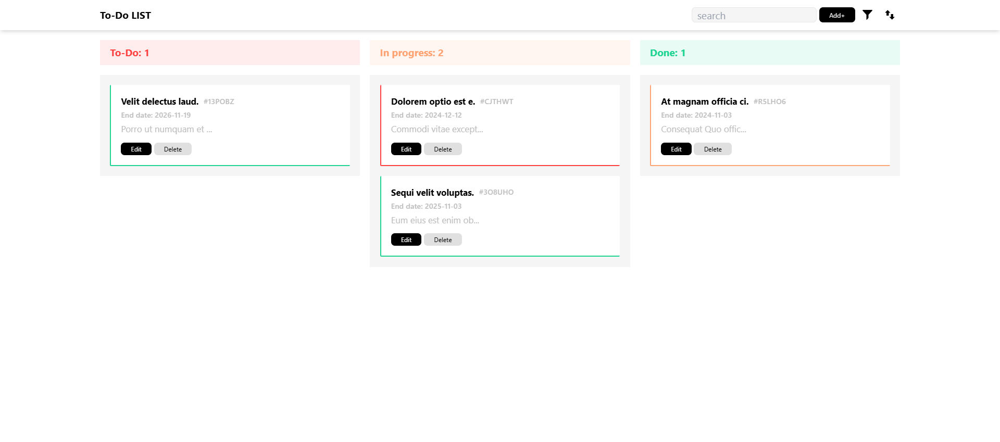

# Brief 3 | To-do List

### Contexte de projet
application de gestion de tâches développée pour améliorer l'efficacité des équipes en leur offrant un moyen simple de gérer, organiser, et suivre leurs tâches. Conçue pour les projets collaboratifs, cette application permet aux utilisateurs de créer des tâches, de suivre leur progression, de les organiser par priorité, et de faciliter la planification des projets.

### Liens exterieurs
- [**Live Demo.**](https://ayoub-ahnaou.github.io/To-do_List/src/)
- [**Presentation Canva.**](https://www.canva.com/design/DAGVdPXl0i4/eUM-LfuF9piQayjITSXDsg/edit)
- [**Planification de projet.**](https://github.com/users/ayoub-ahnaou/projects/1)

### Fonctionnalite principale
- **Affichage de la To Do List** : Interface moderne et épurée, stylisée avec Tailwind CSS pour une expérience utilisateur agréable.
- **Modal d'ajout de tâche** : Ajoutez facilement de nouvelles tâches via un formulaire comportant les champs suivants :
    - Titre
    - Description
    - Statut (To Do, Doing, Done)
    - Priorité visuelle (P1 en rouge, P2 en orange, P3 en vert)
    - Date d’échéance
- **Liste de tâches** : Visualisez les tâches organisées par titre, date d’échéance, et priorité en code couleur, pour une lecture simplifiée.
- **Changement de statut** : Modifiez le statut ou la priorité visuelle de chaque tâche pour refléter son avancement.
- **Statistiques de tâches** : Consultez un aperçu du nombre de tâches par statut.
- **Suppression des tâches** : Supprimez des tâches en un clic.
- **Validation de formulaire** : Assurez la qualité des données saisies grâce à une validation automatique.
- **Déploiement** : Hébergement via GitHub Pages pour tester facilement l'application sur différents appareils et navigateurs.

### Technologies et outils utilisées
- HTML, TailwindCSS, JavaScript.
- Git, GitHub, GitHub Project.
- LocalStorage.